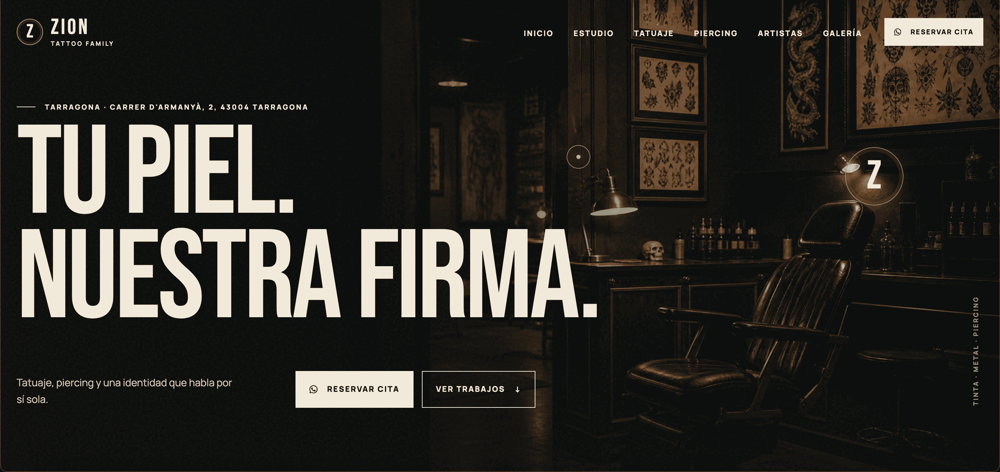
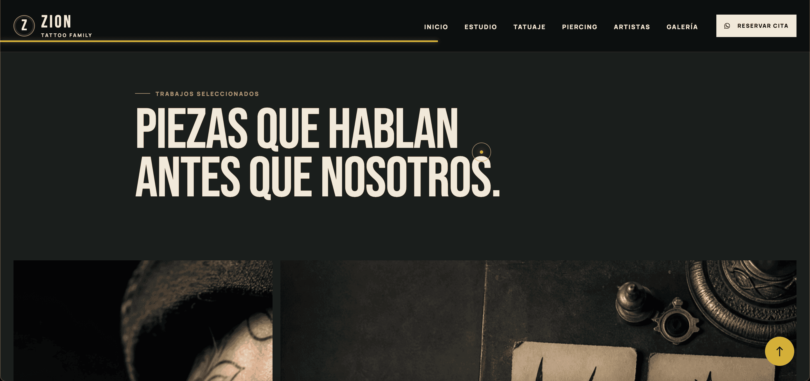
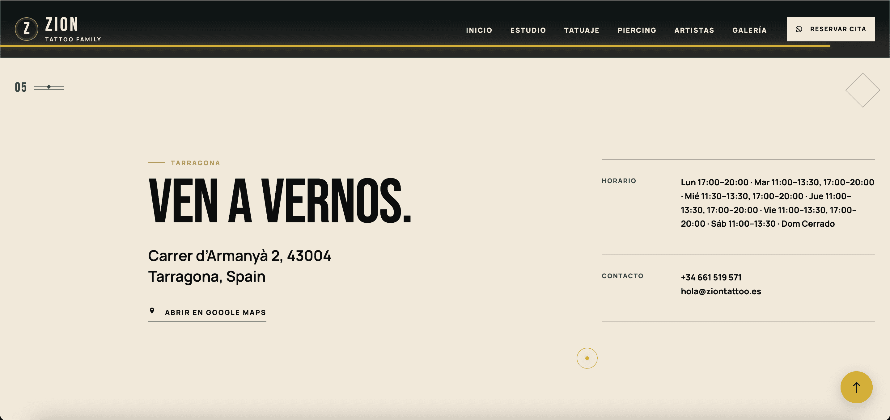
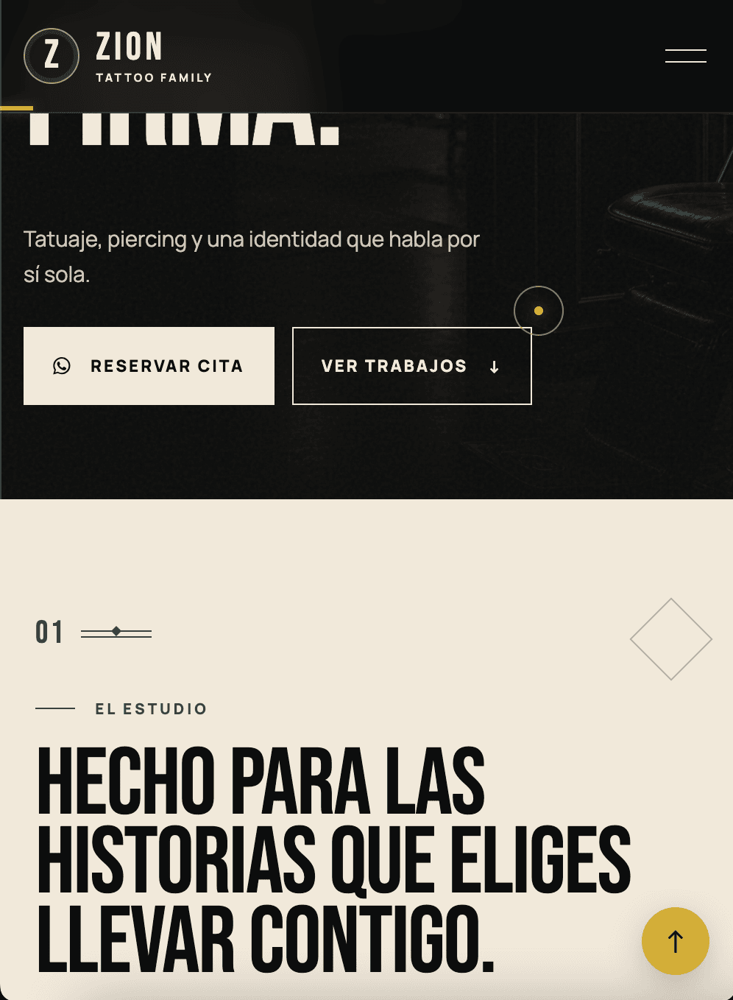
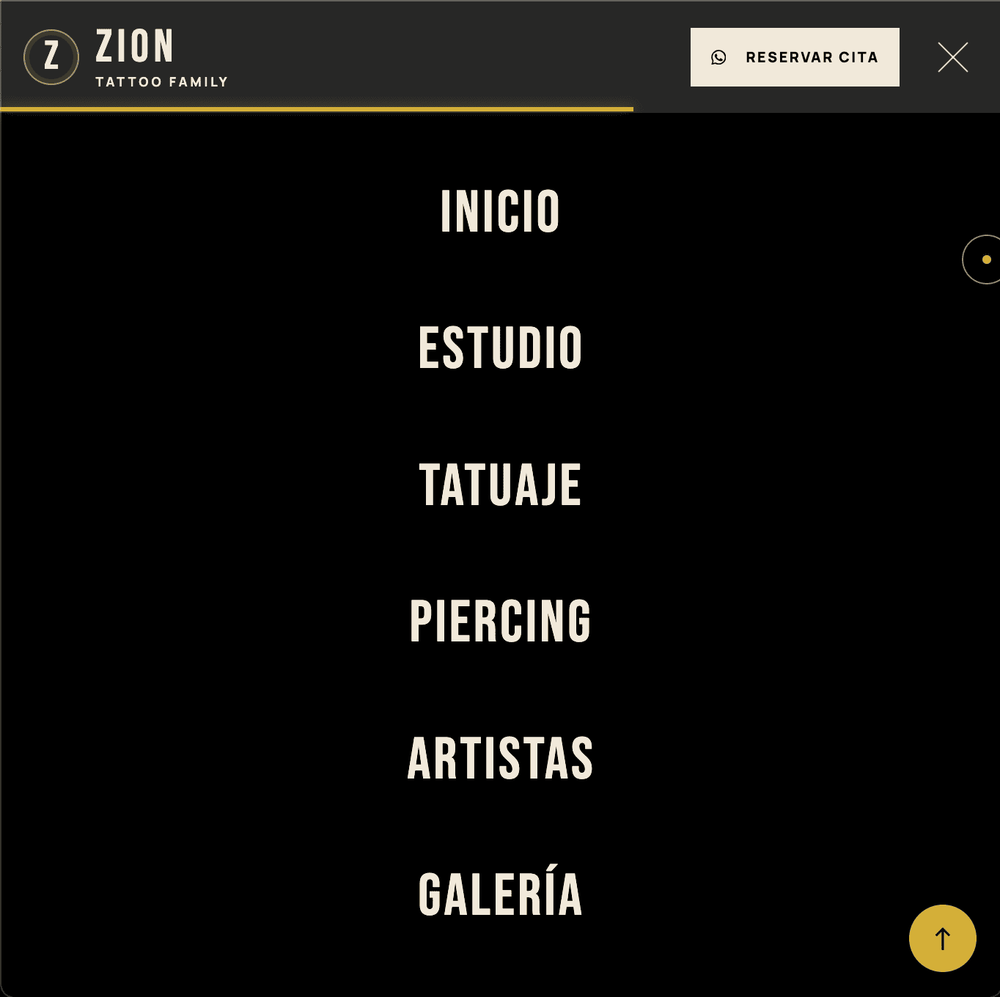

# Zion Tattoo — WordPress Theme

A custom WordPress theme designed for a modern tattoo and piercing studio.

Zion Tattoo was built from scratch with a strong visual identity, responsive layouts, custom content management and subtle animations.

## Features

- Custom WordPress theme built from scratch
- Fully responsive design
- Custom homepage
- Hero section with configurable image
- Tattoo and piercing services
- Custom Artist post type
- Custom Gallery post type
- Artist profiles with images, biographies and specialties
- Gallery managed directly from WordPress
- Gallery lightbox
- WhatsApp booking integration
- Contact and location section
- Google Maps integration
- Instagram integration
- Native WordPress Customizer
- Responsive mobile navigation
- Smooth reveal animations
- Custom image sizes
- Translation-ready
- No Elementor, Divi, WPBakery or ACF required

## Screenshots

### Homepage

### Gallery

### Contact

### Mobile

### Mobile Menu

## WordPress Integration

The theme uses native WordPress functionality instead of external page builders.

Artists and gallery content are managed through custom WordPress post types.

The WordPress Customizer is used to manage studio information, contact details, booking information, social links, images and other website settings.

## Technologies

- WordPress
- PHP
- HTML5
- CSS3
- JavaScript
- WordPress Customizer
- Native WordPress APIs
- Responsive Web Design

## Development

Zion Tattoo was developed as a custom WordPress project for a tattoo and piercing studio.

The project combines custom PHP templates, responsive CSS, JavaScript interactions and native WordPress content management.

## License

This project is provided for portfolio and development purposes.
